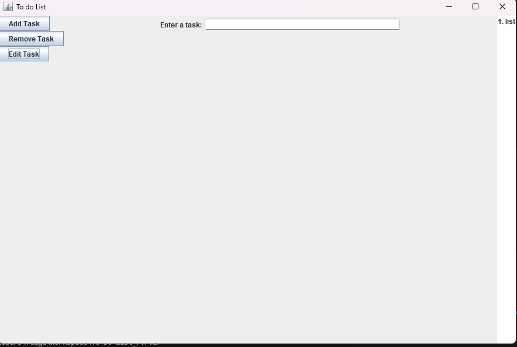

## Getting Started

Welcome to the VS Code Java world. Here is a guideline to help you get started to write Java code in Visual Studio Code.

## Folder Structure

The workspace contains two folders by default, where:

- `src`: the folder to maintain sources
- `lib`: the folder to maintain dependencies

Meanwhile, the compiled output files will be generated in the `bin` folder by default.

> If you want to customize the folder structure, open `.vscode/settings.json` and update the related settings there.

## Dependency Management

The `JAVA PROJECTS` view allows you to manage your dependencies. More details can be found [here](https://github.com/microsoft/vscode-java-dependency#manage-dependencies).

@Project Title TO DO List

@author Colton Feige

@Description Java-based To-Do List application featuring a graphical user interface (GUI) for creating, editing, and managing personal tasks. The application separates logic and presentation layers for maintainable code.

@Project Structure

- `.gitignore`: Specifies files and directories to be ignored by Git version control.
- `README.md`: Project documentation and overview.
- `bin/`: Contains compiled Java class files generated during the build process.
- `lib/`: Directory for external dependencies and libraries required by the project.
- `src/`: Source code directory.
  - `GUI.java`: Implements the graphical user interface for user interaction, including windows, buttons, and task display.
  - `Logic.java`: Handles the core business logic, such as adding, removing, and managing to-do items.

@ How to Use

-Using the Application
- **Adding a Task**:
  - Enter the task description in the text field labeled "Enter a task:".
  - Click the "Add Task" button to add it to the list. The task will appear in the numbered list on the right.

- **Removing a Task**:
  - Select a task from the list by clicking on it.
  - Click the "Remove Task" button. A confirmation dialog will appear if no task is selected.

+I have no idea how to screenshot this
- **Editing a Task**:
  - Select a task from the list.
  - Click the "Edit Task" button. A dialog will prompt you to enter the new task text.
  - Enter the updated text and confirm to save the changes.
  